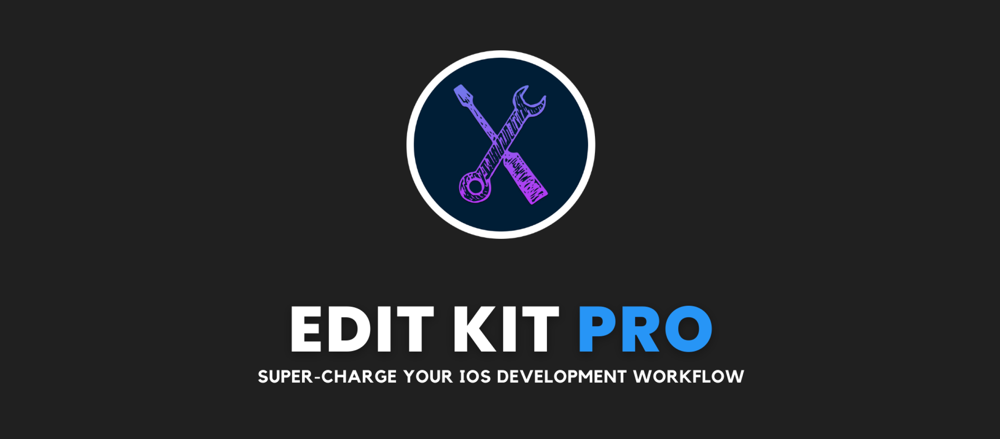

# EditKitPro
EditKit Pro provides a suite of tools to help you write better, cleaner, and more efficient code. Whether you need to quickly format your code, create Codable models, generate mock data, or move around in SwiftUI more efficiently, EditKit Pro has you covered.

This is an open-source Xcode Editor Extension with a variety of mini-tools for iOS / macOS Developers.

## Features
The current version of EditKit supports the following features:

- Align around equals
- Auto `MARK` extensions
- Beautify JSON
- Convert JSON to Codable
- Copy as Markdown
- Create type definition
- Format as multi-line
- Search selection on GitHub, Google, StackOverflow
- Sort imports
- Sort lines alphabetically (ascending and descending)
- Sort lines by length
- Strip trailing whitespaces
- Wrap in `#ifdef`
- Wrap in `NSLocalizedString`
- SwiftUI -> Disable outer view
- SwiftUI -> Delete outer view
- SwiftUI -> Disable outer view
- SwiftUI -> Delete view

Demos of these features can be found on the [blog post](https://digitalbunker.dev/editkit-pro/) and this [YouTube Video](https://www.youtube.com/watch?v=ZM4VHOvPdQU&t=6s&ab_channel=AryamanSharda).

## Installation
The most convenient way of installing the current release is through the [App Store](https://apps.apple.com/us/app/editkit-pro/id1659984546?mt=12). Once installed, you'll need to open `System Preferences -> Extensions -> Enable EditKit Pro`. 

If EditKit Pro is not visible in Extensions, this may be due to multiple conflicting Xcode installations.

Alternatively, you can clone this Xcode project:
 
1. Once downloaded, open the .xcodeproj.
2. Before running, make sure to change the Team to your Personal Development Team for both the main app target and the `EditKit` extension. The extension will not appear in Xcode unless it is signed correctly.
3. Select the `EditKit` extension and hit Run.
4. You should see a debug version of Xcode appear. Pick any project or create a new one.
5. Navigate to a source code file. Now, in the Editor dropdown menu, you should now see an entry for `EditKit`.

## Requirements
Please make sure you **only have one valid** installation of Xcode on your machine and have a valid Apple Developer account as signing the extension will be required in order to run it locally.

## Contributing
All contributions are welcome. Just fork the repo and make a pull request.

1. In order to add new functionality to `EditKit`, create a new entry in `EditorCommandIdentifier` and a assign a unqiue key for your new command. 
2. Then, in the `EditKit` extension's `Info.plist`, add an entry in `XCSourceEditorCommandDefinitions` for your new command.
3. In `EditorController.swift`, add a case to the `handle` function for your new command.
4. Now, you implement your new functionality by creating a new `XCSourceEditorCommand` class (i.e. `BeautifyJSONCommand`) or creating a class that operates on the `XCSourceEditorCommandInvocation` provided by the Xcode Editor Extension (i.e. `AlignAroundEqualsCommand`

```
class AlignAroundEqualsCommand {
    static func perform(with invocation: XCSourceEditorCommandInvocation, completionHandler: (Error?) -> Void) {
        ...
    }
}
```

or 

```
class BeautifyJSONCommand: NSObject, XCSourceEditorCommand {
    func perform(with invocation: XCSourceEditorCommandInvocation, completionHandler: (Error?) -> Void) {
        ....
    }
}
```

All files in the `Third Party` folder are modified versions of the open source libraries mentioned below.

## Open Source Dependencies
EditKit would not have been possible without the help and inspiration from these open source libraries: 

- [XShared](https://github.com/Otbivnoe/XShared/)
- [Xcode Source Editor Extension](https://github.com/cellular/xcodeextensionmark-swift/)
- [alanzeino](https://github.com/alanzeino/source-editor-extension/)
- [DeclareType](https://github.com/timaktimak/DeclareType)
- [Sorter](https://github.com/aniltaskiran/LazyXcode/)
- [Multiliner](https://github.com/aheze/Multiliner/)
- [swiftuitools](https://github.com/tgunr/swiftuitools/)
- [Finch](https://github.com/NicholasBellucci/Finch/)
- [Xcode-Search](https://github.com/skyline75489/Xcode-Search/)

Note: Many of their original implementations have modified to support Swift 5.7+ and to fix bugs.

## Contact
If you have any questions, feel free to message me at [aryaman@digitalbunker.dev](mailto:aryaman@digitalbunker.dev) or on [Twitter](https://twitter.com/aryamansharda).
